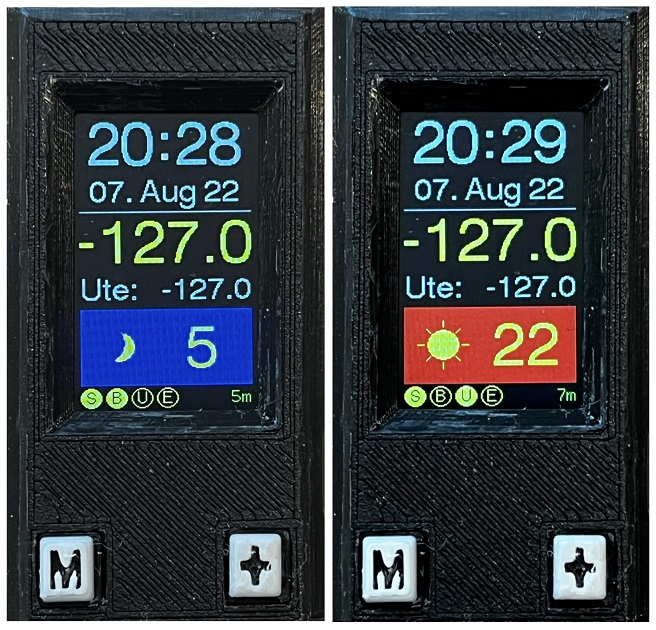
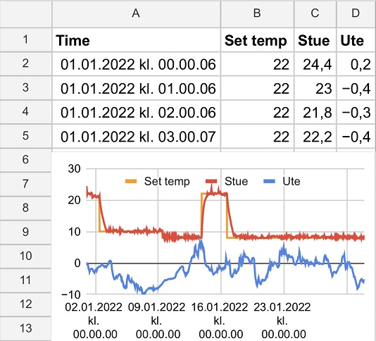
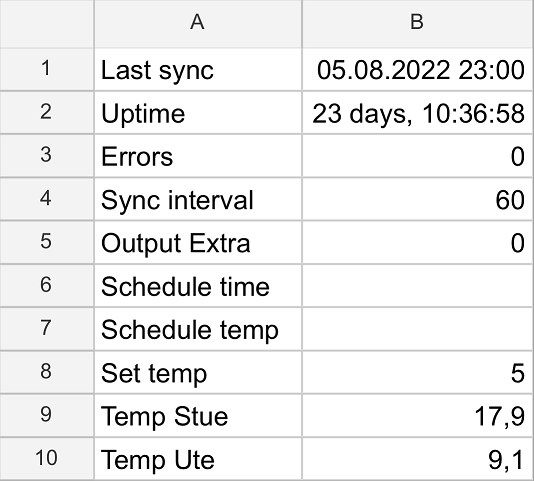
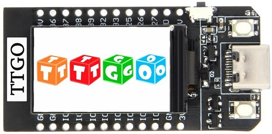
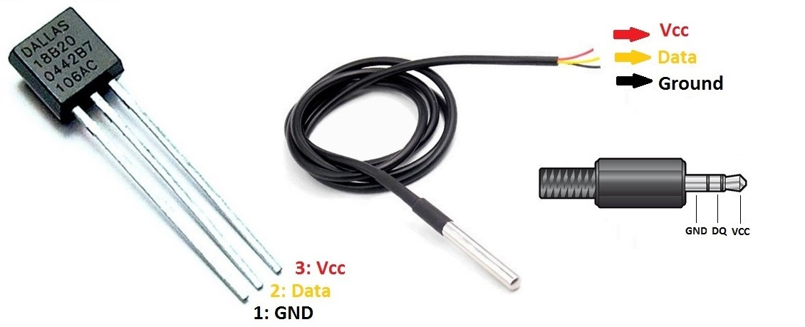
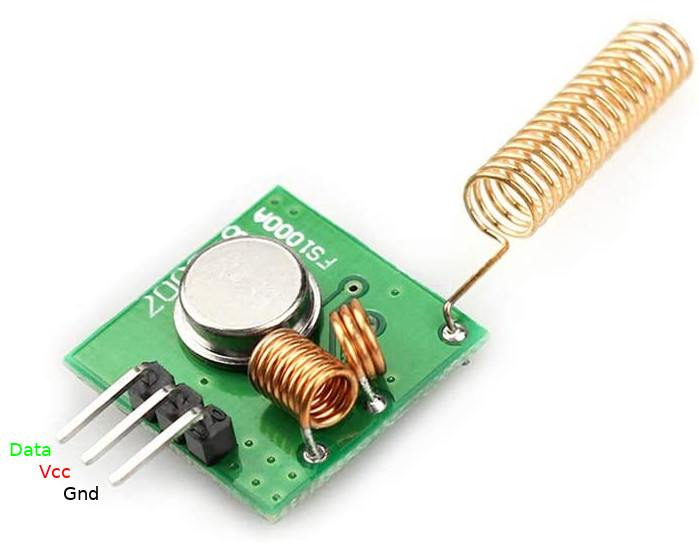
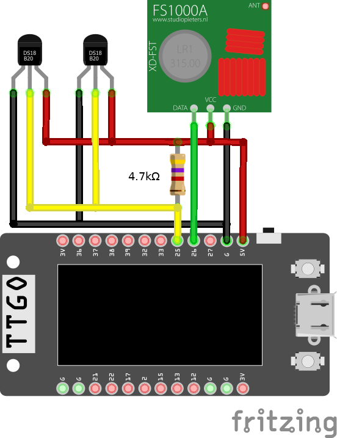
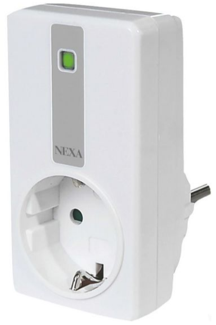
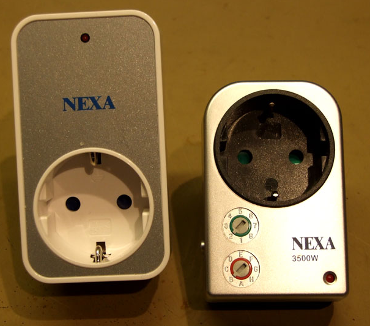
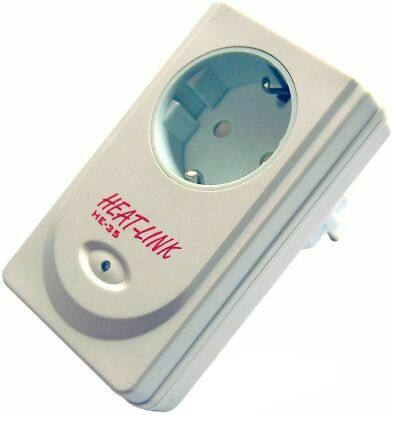

# Introduction
This project is a temperature control system for use in a remote location (e.g. a mountain cabin).

The system consists of an ESP32 microcontroller from Espressif and one or more Dallas/Maxim DS18B20 digital temperature sensors. The desired temperature is achieved by continuously switching on/off one or more electrical heaters using Nexa power plugs (over RF 433 MHz). The ESP32 device periodically connects to the Internet over WiFi, logging the current temperature into a Google spreadsheet. The spreadsheet is also used for setting the desired temperature, which will be transferred to the device during the next synchronization.

The ESP32 code is written in Arduino-style C/C++. Integration with Google spreadsheet is done using Google Apps Script (javascript).

## User interface



The top section displays current date and time. This is updated using NTP, and will be automatically adjusted for DST (daylight saving time). The main temperature is displayed in yellow. Below, the display will cycle through any additional temperature sensors.

The currently set temperature is displayed, and the current temperature mode is indicated:
* :blue_square: :crescent_moon:: frost protection
* :red_square: :sunny:: comfort mode

The bottom line displays the current status of configured power plugs:
* ○: off
* ●: on

The current device activity is displayed at bottom right:
* **Nexa:** Device is transmitting control signals to power plugs (every 5 minutes)
* **WiFi:** Device is connecting to WiFi
* **Time:** Device is updating time from NTP (once per day)
* **Sync:** Device is synchronizing with Google spreadsheet
* **&lt;time&gt;:** Device uptime is displayed when the device is "idle" (only monitoring temperatures)

The two buttons are used for adjusting the desired temperature locally (when you are on-site):
* M: Toggle between temperature modes: frost protection / comfort mode
* +: Increment desired temperature for the currently selected mode. The temperature will roll over from max to min (e.g. 16, 17, ... 24, 25, 16, 17, ...)

## Synchronization
Temperatures will be appended to sheet '&lt;yyyy-mm&gt;' in the configured Google spreadsheet (the sheet will be created if it doesn't exist):



Configuration will be read from the sheet 'config', columns A and B (a sheet with default values will be created if it doesn't exist):
* **Last sync:** Timestamp of last sync
* **Uptime:** Reported uptime from device
* **Errors:** Errors counted by device (e.g. HTTP timeout)
* **Sync interval:** Interval between each synchronization (in minutes)
* **Schedule time:** Scheduled time for applying scheduled temperature as new set temperature
* **Schedule temp:** Set temperature to apply at scheduled time
* **Set temp:** Set (desired) temperature (will be read by device, and updated if changed locally at device)
* **Temp &lt;xyz&gt;:** Current temperature of temperature sensor &lt;xyz&gt;
* **Output &lt;xyz&gt;:** Set status of extra output &lt;xyz&gt;: 0=off, 1=on (read by device)
* ...



## Utility menu system
There is also a utility menu system that is invoked by pressing one of the buttons within a couple of seconds after powering up the device.

You control the menu system using the two buttons:
* M: Skip to next menu item
* +: Invoke function

The menu system contains functionality for:
* Reading addresses of connected temperature sensors
* Manually switching Nexa power plugs on/off. This is useful for testing RF communication, and for programming the Nexa Self Learning power plugs

# Hardware

## LilyGO TTGO T-display ESP32



[LilyGO TTGO T-display ESP32](http://www.lilygo.cn/prod_view.aspx?TypeId=50044&Id=1126&FId=t3:50044:3)
[GitHub](https://github.com/Xinyuan-LilyGO/TTGO-T-Display)

## Dallas/Maxim DS18B20 Temperature sensor



[Dallas DS18B20 Datasheet](https://datasheets.maximintegrated.com/en/ds/DS18B20.pdf)

## FS1000A/XD-FST RF Radio module



[FS1000A/XD-FST Datasheet](http://www.mantech.co.za/Datasheets/Products/433Mhz_RF-TX&RX.pdf)

I've had most success using a straight solid core wire antenna (quarter wave-length, 17.3 cm), rather than the antenna coil shown on the picture.

## Wiring



# Software installation

## Board
* Install/update the [Arduino IDE](https://www.arduino.cc/en/software)
* In **Preferences** set **Additional Board Manager URLs** to `https://raw.githubusercontent.com/espressif/arduino-esp32/gh-pages/package_esp32_index.json`
* Go to **Tools > Board > Boards Manager** and install **esp32** by Espressif Systems
* Go to **Tools > Board > ESP32 Arduino** and select the board **ESP32 Dev Module**
* The board shall be configured like this:
  * **Board:** ESP32 Dev Module
  * **Upload Speed:** 921600
  * **CPU Frequency:** 240MHz (WiFi/BT)
  * **Flash Frequency:** 80MHz
  * **Flash Mode:** QIO
  * **Flash Size:** 4MB (32Mb)
  * **Partition Scheme:** Default 4MB with spiffs (1.2MB APP/1.5 SPIFFS)
  * **Core Debug Level:** None
  * **PSRAM:** Disabled
  * **Arduino runs on:** Core 1
  * **Events runs on:** Core 1
  * **Port:** (the COM port your board has connected to, see below)
* To determine on which COM port your board connects, do the following steps:
  * Unplug the board
  * Have a look at **Tools > Port** and remember which ports you see
  * Plug in the board to the USB port
  * Look again at **Tools > Port**
  * The newly added COM port is the COM port of your board and the one you can select

## Libraries
Go to **Tools > Manage libraries** and install the following libraries:
* **TFT_eSPI** by Bodmer
* **DallasTemperature** by Miles Burton, Tim Newsomem, etc.
* **OneWire** by Jim Studt, Tom Pollard, etc.
* **Arduino_JSON** by Arduino
* **Button2** by Lennart Hennigs

## Custom setup file for TTGO T-Display ST7789V
* Edit the file `C:/Users/%USERNAME%/Documents/Arduino/libraries/TFT_eSPI/User_Setup_Select.h`
 and enable the custom setup file for the display:
    ```
    //#include <User_Setup.h>
    #include <User_Setups/Setup25_TTGO_T_Display.h>
    ```
* [Setup file, alt. 1](https://github.com/Xinyuan-LilyGO/TTGO-T-Display/blob/master/TFT_eSPI/User_Setups/Setup25_TTGO_T_Display.h)
* [Setup file, alt. 2](https://github.com/ubcenvcom/TTGO-EkoTuki-Display/blob/master/TTGO_T_Display.h)

# Configuration

## Configuration file
Use the file `config.h.template` to create a configuration file `config.h` and insert:
* WiFi connection properties
* Google Apps Script ID (see below)
* Temperature sensors:
  * name (Name of sensor, e.g "Livingroom" or "Outside")
  * address (8 bytes) (can be read using the utility menu system)
  * temp (only used internally, set it to 0)
* Nexa switches:
  * name (Name of unit/room/area, e.g. "Livingroom")
  * type (Learning/Simple/He35)
  * id
    * 4 bytes id for 'Learning'
    * 1 byte House and Unit for 'Simple' and 'He35' (0x000000HU)
  * linkedSensor (index of sensor controlling this switch, or -1 if not linked to sensor)
  * activeInMode
    * 1 if active in comfort mode
    * 0 if active in frost protection mode
    * -1 if not linked to mode
  * state (only used internally, set it to false)
  * lastDisplayedState (only used internally, set it to false)

## Configuration of Google spreadsheet
Create a Google spreadsheet with associated Apps Script:
* Create a new Google spreadsheet at [Google spreadsheets](https://docs.google.com/spreadsheets/)
* In the spreadsheet, go to **Extensions/Google Apps Script** and create a new script
* Paste the content of `google-apps-script.gs`
* Save the script and deploy it as a **Web app**
* Choose **Execute as yourself** and **access for anyone**
* You must accept that the Apps Script will have access to your spreadsheets
* Save the **Deployment ID** in APPS_SCRIPT_ID in `config.h`

# Reference material

## ESP32
* [FreeRTOS API reference](https://www.freertos.org/a00106.html)
* [Espressif ESP32 FreeRTOS](https://docs.espressif.com/projects/esp-idf/en/latest/esp32/api-reference/system/freertos.html)
* [ESP32 Dual Core tasks](https://randomnerdtutorials.com/esp32-dual-core-arduino-ide)

## TFT
* [Bodmer TFT_eSPI - library targeted at ESP8266 and ESP32 based boards](https://github.com/Bodmer/TFT_eSPI)
* [Bodmer TFT_eSPI - header file](https://github.com/Bodmer/TFT_eSPI/blob/master/TFT_eSPI.h)

## DS18B20 / OneWire protocol
* [Interfacing DS18B20 1-Wire Digital Temperature Sensor with Arduino](https://lastminuteengineers.com/ds18b20-arduino-tutorial)
* [The complete guide for DS18B20 digital temperature sensors with Arduino](https://www.makerguides.com/ds18b20-arduino-tutorial)

## Nexa protocols

### Nexa L (Self Learning)
This protocol is used by today's "System Nexa" power plugs, e.g. [MYCR-3500](https://nexa.se/smarta-hem/systemnexa/plugin/mycr-3500), [MYCR-2300](https://nexa.se/smarta-hem/systemnexa/plugin/mycr-2300), [LCMR-1000](https://nexa.se/smarta-hem/systemnexa/inbyggnadsmottagare/lcmr1000) and EYCR-2300.



```
BIT FORMAT:
             ┌───┐
'S' (sync):  │ T │                  10T
             ┘   └───┴───┴───┴───┴───┴───┴───┴───┴───┴───
             ┌───┐                   ┌───┐
'0' bit:     │ T │         5T        │ T │ T
             ┘   └───┴───┴───┴───┴───┘   └───
             <------physical 0------><-ph 1->
             ┌───┐   ┌───┐
'1' bit:     │ T │ T │ T │         5T
             ┘   └───┘   └───┴───┴───┴───┴───
             <-ph 1-><------physical 0------>
             ┌───┐
'P' (pause): │ T │               40T
             ┘   └───┴───┴───┴───//───┴───┴───┴───
T = 250 us

Every logical bit '0' and '1' is sent as two physical bits, where the second one is the inverse of the first one. '0' => '01', '1' => '10'.

PACKET FORMAT:
Each packet consists of a sync bit followed by 26 + 6 bits and ended by a pause bit.
Packets are sent 5 times or more (Nexa) / 6 times or more (Proove/Anslut).
┌───┬────────────────────────────┬───┬───┬────┬────┬───┐
│ S │ UUUUUUUUUUUUUUUUUUUUUUUUUU │ G │ A │ CC │ II │ P │
└───┴────────────────────────────┴───┴───┴────┴────┴───┘
Duration = (11*250) + 32*(8*250) + (41*250) = 77000 us

S = Sync bit.
U = Unique id, 26 bits. This is this code that the reciever "learns" to recognize.
G = Group bit, to address all units in group. All units = '0', one unit = '1'.
A = Activation bit. On = '0', off = '1'.
C = Channel bits. Proove/Anslut = '00', Nexa = '11'.
I = Unit bits for Proove/Anslut. 1 = '00', 2 = '01', 3 = '10', 4 = '11'.
    Unit bits for Nexa.          1 = '11', 2 = '10', 3 = '01', 4 = '00'.
P = Pause bit.
```

### Nexa Simple
This protocol is used by older type Nexa power plugs, where you set house code (A-F) and unit number (1-8) on the device, e.g. SYCR-3500.



```
BIT FORMAT:
             ┌───┐           ┌───┐
'0' bit:     │ T │     3T    │ T │     3T
             ┘   └───┴───┴───┘   └───┴───┴───
             ┌───┬───┬───┐   ┌───┬───┬───┐
'1' bit:     │     3T    │ T │     3T    │ T
             ┘           └───┘           └───
             ┌───┐           ┌───┬───┬───┐
'X' bit:     │ T │     3T    │     3T    │ T
             ┘   └───┴───┴───┘           └───
             ┌───┐
'P' (pause): │ T │               32T
             ┘   └───┴───┴───┴───//───┴───┴───┴───
T = 350 us

PACKET FORMAT:
Each packet consists of 12 trinary bits followed by a pause (stop/sync) bit.
Packets are sent 4 times or more.
┌──────┬──────┬─────┬───┬───┐
│ HHHH │ IIII │ ??? │ A │ P │
└──────┴──────┴─────┴───┴───┘
Duration = 12*(8*350) + 33*350 = 45150 us

H = House bits. A = '0000', B = 'X000', C = '0X00', D = 'XX00', ... H = 'XXX0'.
I = Unit bits.  1 = '0000', 2 = 'X000', 3 = '0X00', 4 = 'XX00', ... 8 = 'XXX0'.
? = Unknown bits. Always '0XX'.
A = Activation bit. On = 'X', off = '0'.
P = Pause (stop/sync) bit.
```

### Heat-Link HE-35
This protocol is used by the older HE-35 power plug from Hellmertz Elektronik AS, where you set house code (A-F) and unit number (1-4) on the device. This power plug was previously used together with the [Heat-Link](https://holars.no/kategori/33/heat-link-a224-varmestyrning-ring-hytta-varm/) temperature control system.



```
BIT FORMAT:
The same as Nexa Simple bit format
T = 420 us

PACKET FORMAT:
Each packet consists of 12 trinary bits followed by a pause (stop/sync) bit.
Packets are sent 7 times or more.
┌────────┬──────┬───┬───┬───┐
│ HHHHHH │ IIII │ ? │ A │ P │
└────────┴──────┴───┴───┴───┘
Duration = 12*(8*420) + 33*420 = 54180 us

H = House bits. A = '0XXXXX', B = 'X0XXXX', C = 'XX0XXX', ... F = 'XXXXX0'.
I = Unit bits.  1 = 'XXX0', 2 = 'XX0X', 3 = 'X0XX', 4 = '0XXX'.
? = Unknown bits. Always '0'.
A = Activation bit. On = 'X', off = '0'.
P = Pause (stop/sync) bit.
```
